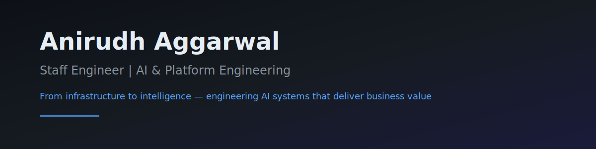

  

  &nbsp;
  &nbsp;
  

 

## About

Staff Engineer with 8+ years of experience spanning full-stack application development, cloud infrastructure, and AI/ML systems. Currently driving AI platform strategy and engineering at a Fortune 500 financial services company, where my work has contributed to AI-powered underwriting that processes approvals in under 2 minutes and contact centre intelligence serving 110M+ calls annually. I focus on turning cutting-edge AI into production-grade systems that deliver measurable business outcomes across the financial services and retail sectors.

## What I Build

<table>
  <tr>
    <td width="33%" valign="top">
      <h3 align="center">AI in Financial Services</h3>
      
Intelligent underwriting engines, risk assessment models, and AI-driven decision systems for insurance and financial products. Building systems that process approvals in minutes, not weeks.

    </td>
    <td width="33%" valign="top">
      <h3 align="center">AI Platform & Strategy</h3>
      
Global AI platform architecture, MLOps pipelines, responsible AI frameworks, and enterprise-wide GenAI enablement. Setting strategy that scales AI across an organization.

    </td>
    <td width="33%" valign="top">
      <h3 align="center">Contact Centre Intelligence</h3>
      
GenAI-powered knowledge systems, voice analytics, RAG-based contract lookup, and automated call analysis serving 110M+ calls annually.

    </td>
  </tr>
</table>

## Tech Stack

**AI / ML**

**Languages**

**Frontend**

**Cloud**

**Infrastructure**

## GitHub Stats

  
  &nbsp;&nbsp;
  

---

  <i>Open to collaborations on AI/ML, platform engineering, and open-source projects.</i>
    
  

