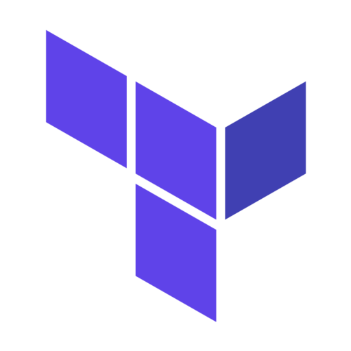
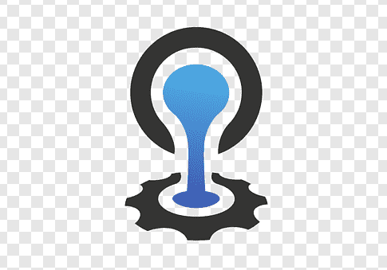

## Hi there, I'm Ani 👋

  
  

 

- 🔭 I'm working at [Manulife](https://www.manulife.ca) [@manulife-ca](https://github.com/manulife-ca)
- 🌱 I’m currently learning [Go](https://golang.org/), ML/AI
- 👯 I’m looking to collaborate on any open-source projects or personal pet projects.
- 📫 Reach me by [email](mailto://ani.aggarwal@mail.utoronto.ca) or message me at [linkedin](https://www.linkedin.com/in/aniaggarwal/)
- 🎓 Education: Diploma from [Humber College](https://humber.ca/) and a Bachelors Degree from [York University](https://www.yorku.ca/)
- 😄 Pronouns: He, Him
- ⚡ Fun fact: I love 🔧 🍕
- 📝 [Resume](#)

<h2 align="center">Langages and Tools</h2>
 
 

  
  
  
  
  
  
  
  
  
  
  
  
  
  
  
  
  
  

 
<!--  -->
